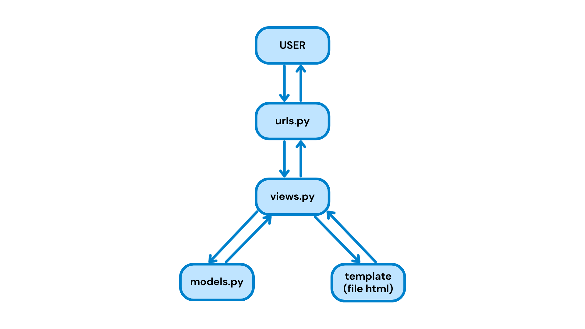
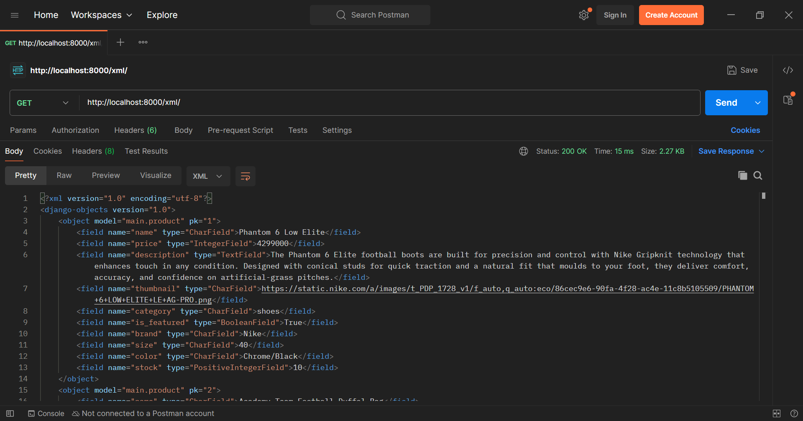
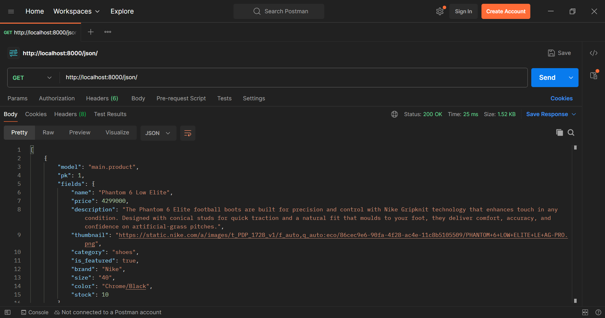
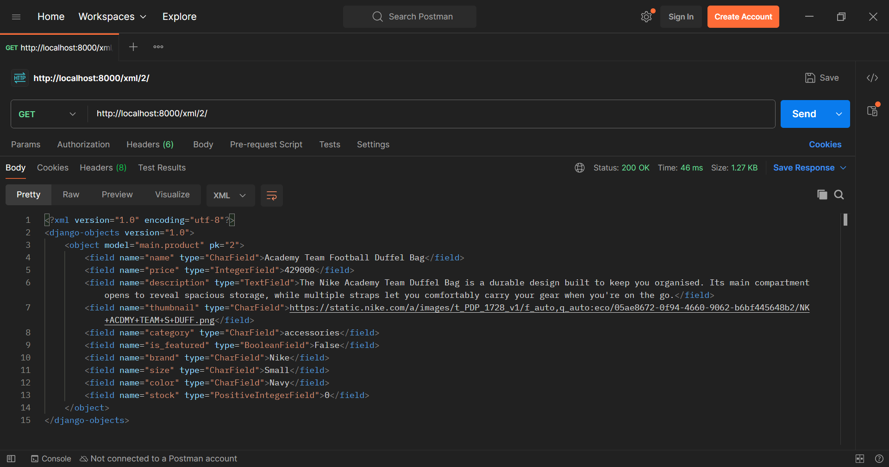
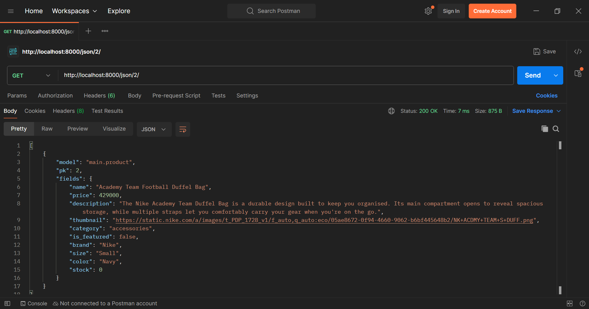

## Tugas Individu 2

**PWS**: https://sahila-khairatul-goalsnglory.pbp.cs.ui.ac.id/

### 1. Cara mengimplementasikan checklist tugas 2:
- Membuat direktori utama goals-n-glory
- Membuat dan mengaktifkan virtual environment
- Menyiapkan dependencies di file `requirements.txt` dan install melalui terminal
- Membuat project django dengan nama goals_n_glory melalui terminal
- Membuat file `.env` dan `.env.prod` dan mengisinya dengan konfigurasi
- Modifikasi file `settings.py`: menambahkan `load_dotenv()`, menambahkan localhost ke `ALLOWED_HOSTS`, konfigurasi production dan database
- Migrate dan run server django
- Membuat aplikasi `main` dengan `python manage.py startapp main`
- Menambahkan 'main' ke `INSTALLED_APPS` di `settings.py`
- Membuat model `Product` di `main/models.py`, dengan atribut: name, price, description, thumbnail, category, is_featured, brand, size, color, stock
- Migrate model dengan `python manage.py makemigrations` dan `python manage.py migrate` melalui terminal
- Membuat fungsi `show_main` di `main/views.py` dan mengisinya dengan dictionary berisi nama, npm, kelas, dan nama aplikasi untuk dikirimkan ke `main.html`
- Membuat folder `templates` di `main`
- Menambahkan file `main.html` dan mengisinya dengan yang ingin ditampilkan di web (nama, npm, kelas, dan nama aplikasi yang direturn oleh fungsi `show_main` di `main/views.py`)
- Routing dengan membuat `urls.py` di `main` dan mengisinya dengan `path('', show_main, name="show_main")`
- Menambahkan `path('', include('main.urls'))` di `goals_n_glory/urls.py`
- Push ke github
- Create new project di PWS, isi environs dengan kode dari `.env.prod`, tambahkan url deployment PWS pada `ALLOWED_HOSTS` di `settings.py`
- Push ke PWS

### 2. Bagan alur request-response dan kaitan antara urls.py, views.py, models.py, dan berkas html

Referensi: https://medium.com/@AyushAgrawal_/understanding-django-mvt-architecture-and-view-functions-django-full-course-for-beginners-lesson-39c8da093b44

- User mengirim request ke django melalui browser, misalnya mengakses URL (HTTP request)
- `urls.py` menerima request dan mencocokkan alamat URL dengan path yang ada di `urlpatterns` untuk menentukan fungsi pada `views.py` yang sesuai. Jika tidak ada yang cocok akan kembalikan `404 Not Found` sebagai response.
- `views.py` mengambil alih, menjalankan logika sesuai kebutuhan.
- Jika ada urusan dengan data, `views.py` akan berinteraksi dengan `models.py` untuk membaca atau menyimpan informasi ke database. Hasilnya akan dikembalikan ke `views.py`.
- Jika tampilan HTML dibutuhkan, `views.py` akan meneruskan data tersebut ke template (file HTML) untuk disusun menjadi tampilan halaman web.
- Django mengirim response ke browser (HTTP response)
- Browser menampilkan hasil halaman web

### 3. Peran settings.py dalam proyek Django
`settings.py` berperan sebagai pusat kontrol proyek Django yang memuat seluruh konfigurasi proyek, seperti menyimpan daftar aplikasi aktif, pengaturan database, middleware, template, static files, bahasa dan time zone, kunci keamanan, serta daftar allowed hosts.

### 4. Cara kerja migrasi database di Django
- Definisikan model di `models.py` yang nantinya akan Django anggap sebagai blueprint tabel database
- Jalankan `python manage.py makemigrations`, jika berbeda dengan yang sudah ada atau belum ada sama sekali, Django akan membuat file migration baru di folder migrations/. Isinya berupa instruksi untuk mengubah database.
- Jalankan `python manage.py migrate`, Django menjalankan instruksi di file migration tadi ke database. Struktur tabel di database akan sesuai dengan definisi model di `models.py`

### 5. Mengapa framework Django dijadikan permulaan pembelajaran pengembangan perangkat lunak?
Karena Django python-based, yang di mana python dikenal dengan readabilitynya dan cenderung mudah untuk dipahami. Selain itu, Django sudah memiliki banyak built-in features, sehingga tidak perlu banyak set-up dan bisa langsung fokus ke pembuatan web.

### 6. Feedback untuk asisten dosen terkait tutorial 1
Asdos sangat responsif dan solutif ketika sesi tutorial, serta penjelasan dalam tutorial 1 membantu saya memahami apa yang sedang saya lakukan. Sebagai masukan, mungkin ke depannya bisa ditambahkan note step mana saja yang krusial dan yang boleh di skip ketika hanya melakukan perubahan pada project (sudah bukan inisiasi awal lagi).

## Tugas Individu 3

### 1. Mengapa kita memerlukan data delivery dalam pengimplementasian sebuah platform?
Karena informasi yang tersimpan di server harus dapat disalurkan ke pengguna atau sistem lain lewat format standar seperti JSON atau XML, tidak berhenti di server saja. Data delivery memastikan data dapat diakses, ditampilkan, dan digunakan oleh pihak yang membutuhkan.

### 2. Menurutmu, mana yang lebih baik antara XML dan JSON? Mengapa JSON lebih populer dibandingkan XML?
JSON lebih sederhana, lebih human-readable, dan cepat diproses dibandingkan XML. JSON juga fleksibel, mendukung struktur data yang kompleks, dan dapat digunakan di berbagai bahasa pemrograman, sehingga sering digunakan di web modern. XML sebenarnya memiliki kelebihan di validasi data yang ketat, tetapi formatnya lebih panjang dan kompleks. Karena itulah JSON lebih populer dibandingkan XML.

### 3. Fungsi dari method is_valid() pada form Django dan mengapa kita membutuhkan method tersebut
Method `is_valid()` mengecek apakah data yang dikirim melalui form sesuai aturan validasi (seperti tipe data, field wajib, panjang teks, dll). Kalau valid, hasilnya True dan data bisa diakses lewat `form.cleaned_data`. Kalau tidak, hasilnya False dan error akan tersimpan di `form.errors`. Method ini mencegah data tidak valid masuk ke database.

### 4. Mengapa kita membutuhkan csrf_token saat membuat form di Django? Apa yang dapat terjadi jika kita tidak menambahkan csrf_token pada form Django? Bagaimana hal tersebut dapat dimanfaatkan oleh penyerang?
`csrf_token` mencegah serangan Cross-Site Request Forgery (CSFR), yaitu ketika penyerang membuat user tanpa sadar mengirim request lewat website palsu. Tanpa token ini, Django tidak bisa membedakan request asli dan palsu, sehingga penyerang bisa memanfaatkan sesi login user untuk mengirim form berbahaya. Django membedakan request asli atau palsu dengan mencocokkan `csrf_token` unik yang dikirim bersama form dengan token yang disimpan di server.

### 5. Cara mengimplementasikan checklist tugas 3
- Membuat `forms.py` di `main/` berisi `ProductForm` berbasis `ModelForm` untuk input data `Product`, dengan field sesuai atribut `Product`.
- Menambahkan fungsi di `main/views.py`: `show_main` yang mengambil semua objek Product dan menampilkannya di halaman utama, `add_product` yang menampilkan dan memproses form untuk tambah Product baru, dan `show_product` yang menampilkan detail produk berdasarkan ID.
- Menambahkan URL routing di `main/urls.py` untuk `add_product` dan `show_product`.
- Memodifikasi `main.html` agar menampilkan daftar produk, tombol Add Product, dan link detail tiap produk.
- Membuat file html baru di `main/templates/`: `add_product.html` untuk halaman form tambah produk dan `product_detail.html` untuk halaman detail produk.
- Menambahkan URL deployment PWS ke `CSRF_TRUSTED_ORIGINS` di `settings.py`
- Menambahkan fungsi `show_xml` dan `show_json` di `main/views.py` untuk mengembalikan data dalam format XML dan JSON.
- Menambahkan routing `/xml/` dan `/json/` di `main/urls.py`.
- Menambahkan fungsi `show_xml_by_id` dan `show_json_by_id` di `main/views.py` untuk mengembalikan data berdasarkan ID produk.
- Menambahkan routing `/xml/<str:product_id>/` dan `/json/<str:product_id>/` di `main/urls.py`

### 6. Feedback untuk asisten dosen terkait tutorial 2
Tidak ada. Penjelasan di tutorial 2 sudah cukup membantu dalam pengerjaan tugas 3.

### Hasil akses URL pada Postman

## Tugas 4

### 1.  Apa itu Django AuthenticationForm? Jelaskan juga kelebihan dan kekurangannya.
AuthenticationForm adalah form bawaan Django (dari `django.contrib.auth.forms`) untuk proses login yang sudah menyediakan field username dan password, serta validasi terintegrasi dengan sistem autentikasi Django. Kelebihannya adalah mudah digunakan, aman, dan siap pakai. Kekurangannya adalah hanya mendukung login dengan username & password, tampilannya standar sehingga sering perlu diubah, tidak punya fitur "remember me" bawaan, serta kurang fleksibel jika ingin login dengan email, nomor HP, atau lainnya.

### 2. Apa perbedaan antara autentikasi dan otorisasi? Bagaiamana Django mengimplementasikan kedua konsep tersebut?
Autentikasi memverifikasi identitas user yang login ("siapa" user). Otorisasi menentukan apa yang boleh dilakukan oleh user (hak akses). Django mengimplementasikan autentikasi dengan `authenticate()`, `login()`, `AuthenticateForm`. Untuk otorisasi, Django menyediakan sistem permissions yang bisa diatur, dan decorator seperti `@login_required` dan `@permission_required` untuk membatasi akses.

### 3. Apa saja kelebihan dan kekurangan session dan cookies dalam konteks menyimpan state di aplikasi web?
- Cookies (client-side): Kelebihannya adalah ringan, mudah diakses, bisa lintas tab/window, dan tidak membebani server. Kekurangannya adalah kapasitas terbatas (±4KB), rentan dimanipulasi klien, dan kurang aman untuk menyimpan data sensitif.
- Session (server-side): Kelebihannya adalah lebih aman (data asli ada di server), klien hanya memegang session ID yang dikirim melalui cookie, kapasitas lebih besar (±5MB), dan aman untuk menyimpan data sensitif. Kekurangannya adalah menambah beban server karena harus menyimpan data setiap user, dan akan hilang/kedaluwarsa saat tab ditutup.

### 4. Apakah penggunaan cookies aman secara default dalam pengembangan web, atau apakah ada risiko potensial yang harus diwaspadai? Bagaimana Django menangani hal tersebut?
Penggunaan cookies tidak otomatis aman sepenuhnya, karena dapat dicuri, dimanipulasi, atau disalahgunakan melalui serangan seperti XSS (Cross-Site Scripting) atau session hijacking. Django membantu melindungi cookies dengan fitur bawaan seperti HttpOnly (supaya tidak bisa diakses lewat JavaScript), Secure (hanya lewat HTTPS), SameSite (mencegah serangan CSRF), atau seperti pada project ini yang menggunakan `csrf_token` untuk menangani serangan CSRF. Selain itu, Django hanya menyimpan session ID di cookie, bukan data sensitif langsung.

### 5. Step-by-step implementasi checklist tugas 4:
- Mengimport `UserCreationForm` dan `messages`, dan menambahkan fungsi `register` untuk menampilkan form pendaftaran dan menyimpan akun baru di `main/views.py`.
- Membuat `register.html` di `main/templates/` untuk tampilan halaman form registrasi akun dan menambahkan path `register/` di `main/urls.py`.
- Mengimport `authenticate`, `login`, dan `AuthenticationForm`, dan menambahkan fungsi login_user untuk autentikasi dan login di `main/views.py`.
- Membuat `login.html` di `main/templates/` untuk tampilan halaman form login dan menambahkan path `login/` di `main/urls.py`.
- Mengimport `logout` dan menambahkan fungsi `logout_user` untuk menghapus session login di `main/views.py`.
- Menambahkan tombol logout di `main.html` dan menambahkan path `logout/` di `main/urls.py`.
- Mengimport `login_required` di `main/views.py` dan menambahkan decorator `@login_required(login_url='/login')` pada fungsi `show_main` dan `show_product` untuk membatasi akses halaman.
- Memodifikasi `main/views.py` agar menyimpan data login ke cookies: mengimport `datetime`, `HttpResponseRedirect`, dan `reverse`, mengubah `login_user` agar menyimpan cookie `last_login` saat login, menambahkan `last_login` ke context di `show_main`, mengubah `logout_user` agar menghapus cookie `last_login` saat logout.
- Menampilkan username dan informasi `last_login` user di `main.html`.
- Memodifikasi `main/models.py` untuk menghubungkan model `Product` dengan `User`: mengimport `User`, menambahkan field `user = models.ForeignKey(User, on_delete=models.CASCADE, null=True)` pada model `Product`, dan melakukan migrasi (`makemigrations` dan `migrate`).
- Memodifikasi fungsi `add_product` di `main/views.py` untuk menghubungkan data user saat membuat product: menyimpan form dengan `commit=False` dan menambahkan `product_entry.user = request.user` sebelum `save()`.
- Mengubah `show_main` di `main/views.py` agar bisa filter `Product` berdasarkan query parameter filter `all` atau `my`.
- Menambahkan tombol filter All Articles dan My Articles di `main.html`.
- Menampilkan username pembuat product di `product_detail.html`.
- Membuat 2 akun user dengan masing-masing 3 dummy product di lokal.