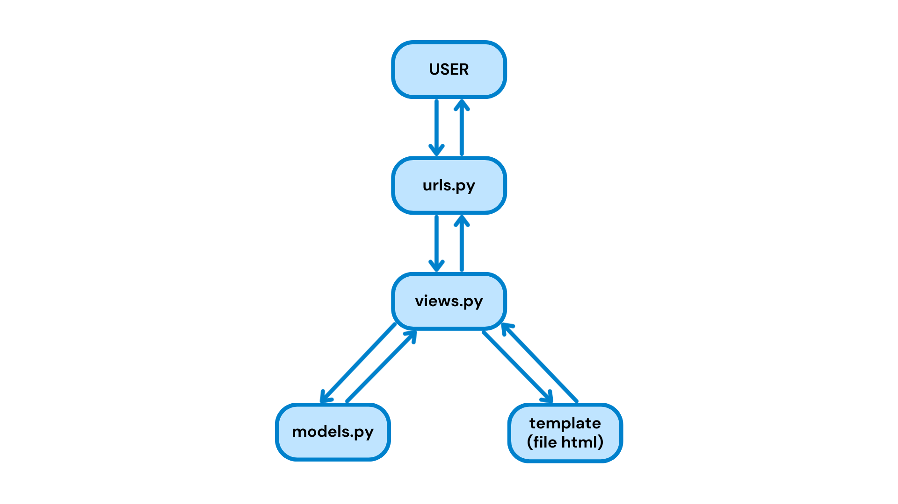

## Tugas Individu 2

**PWS**: https://sahila-khairatul-goalsnglory.pbp.cs.ui.ac.id/

### 1. Cara mengimplementasikan checklist tugas 2:
- Membuat direktori utama goals-n-glory
- Membuat dan mengaktifkan virtual environment
- Menyiapkan dependencies di file `requirements.txt` dan install melalui terminal
- Membuat project django dengan nama goals_n_glory melalui terminal
- Membuat file `.env` dan `.env.prod` dan mengisinya dengan konfigurasi
- Modifikasi file `settings.py`: menambahkan `load_dotenv()`, menambahkan localhost ke `ALLOWED_HOSTS`, konfigurasi production dan database
- Migrate dan run server django
- Membuat aplikasi `main` dengan `python manage.py startapp main`
- Menambahkan 'main' ke `INSTALLED_APPS` di `settings.py`
- Membuat model `Product` di `main/models.py`, dengan atribut: name, price, description, thumbnail, category, is_featured, brand, size, color, stock
- Migrate model dengan `python manage.py makemigrations` dan `python manage.py migrate` melalui terminal
- Membuat fungsi `show_main` di `main/views.py` dan mengisinya dengan dictionary berisi nama, npm, kelas, dan nama aplikasi untuk dikirimkan ke `main.html`
- Membuat folder `templates` di `main`
- Menambahkan file `main.html` dan mengisinya dengan yang ingin ditampilkan di web (nama, npm, kelas, dan nama aplikasi yang direturn oleh fungsi `show_main` di `main/views.py`)
- Routing dengan membuat `urls.py` di `main` dan mengisinya dengan `path('', show_main, name="show_main")`
- Menambahkan `path('', include('main.urls'))` di `goals_n_glory/urls.py`
- Push ke github
- Create new project di PWS, isi environs dengan kode dari `.env.prod`, tambahkan url deployment PWS pada `ALLOWED_HOSTS` di `settings.py`
- Push ke PWS

### 2. Bagan alur request-response dan kaitan antara urls.py, views.py, models.py, dan berkas html

Referensi: https://medium.com/@AyushAgrawal_/understanding-django-mvt-architecture-and-view-functions-django-full-course-for-beginners-lesson-39c8da093b44

- User mengirim request ke django melalui browser, misalnya mengakses URL (HTTP request)
- `urls.py` menerima request dan mencocokkan alamat URL dengan path yang ada di `urlpatterns` untuk menentukan fungsi pada `views.py` yang sesuai. Jika tidak ada yang cocok akan kembalikan `404 Not Found` sebagai response.
- `views.py` mengambil alih, menjalankan logika sesuai kebutuhan.
- Jika ada urusan dengan data, `views.py` akan berinteraksi dengan `models.py` untuk membaca atau menyimpan informasi ke database. Hasilnya akan dikembalikan ke `views.py`.
- Jika tampilan HTML dibutuhkan, `views.py` akan meneruskan data tersebut ke template (file HTML) untuk disusun menjadi tampilan halaman web.
- Django mengirim response ke browser (HTTP response)
- Browser menampilkan hasil halaman web

### 3. Peran settings.py dalam proyek Django
`settings.py` berperan sebagai pusat kontrol proyek Django yang memuat seluruh konfigurasi proyek, seperti menyimpan daftar aplikasi aktif, pengaturan database, middleware, template, static files, bahasa dan time zone, kunci keamanan, serta daftar allowed hosts.

### 4. Cara kerja migrasi database di Django
- Definisikan model di `models.py` yang nantinya akan Django anggap sebagai blueprint tabel database
- Jalankan `python manage.py makemigrations`, jika berbeda dengan yang sudah ada atau belum ada sama sekali, Django akan membuat file migration baru di folder migrations/. Isinya berupa instruksi untuk mengubah database.
- Jalankan `python manage.py migrate`, Django menjalankan instruksi di file migration tadi ke database. Struktur tabel di database akan sesuai dengan definisi model di `models.py`

### 5. Mengapa framework Django dijadikan permulaan pembelajaran pengembangan perangkat lunak?
Karena Django python-based, yang di mana python dikenal dengan readabilitynya dan cenderung mudah untuk dipahami. Selain itu, Django sudah memiliki banyak built-in features, sehingga tidak perlu banyak set-up dan bisa langsung fokus ke pembuatan web.

### 6. Feedback untuk asisten dosen terkait tutorial 1
Asdos sangat responsif dan solutif ketika sesi tutorial, serta penjelasan dalam tutorial 1 membantu saya memahami apa yang sedang saya lakukan. Sebagai masukan, mungkin ke depannya bisa ditambahkan note step mana saja yang krusial dan yang boleh di skip ketika hanya melakukan perubahan pada project (sudah bukan inisisasi awal lagi).